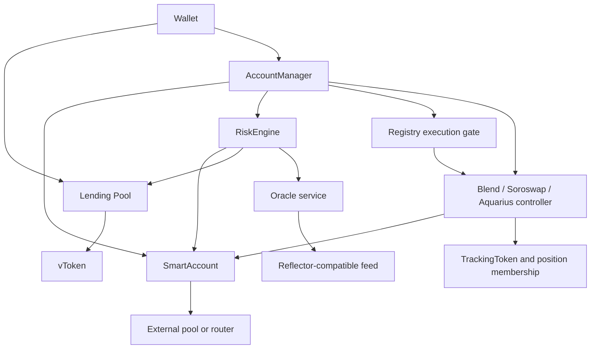

## Contract architecture

Earn users supply directly to a lending pool. Margin owners call AccountManager, which coordinates account custody, borrowing, repayment, and external strategies. SmartAccounts hold the actual tokens; Registry maps tokens, pools, accounts, controllers, and tracking metadata.

ControllerFacade is available for capability checks, but the optimized `exec` path reads Registry's batched execution gate and calls the controller directly. Live post-exec and post-borrow health validation is admin configurable. Borrow and withdrawal checks, controller allowlists, ledger accounting, and liquidation valuation are distinct checks.

## Application architecture

`mercury-stellar-backend` is a **Next.js application with both frontend screens and server API routes**. It uses React, TanStack Query, Zustand, Stellar SDK transaction builders, Freighter, and optional Privy embedded-wallet signing.

The main screens are Margin, Portfolio, Earn, Spot, Farm, Analytics, and Copilot. Pro is the default mode; Lite is a persisted UI preference exposing simplified strategy management. Perps and options routes redirect to Spot.

Read services combine Soroban simulation, Horizon, cached pool/account APIs, and Mercury history with RPC fallback. Hubble/BigQuery powers a separate server-gated stats surface. Copilot adds planning, execution approval, and optional external MCP/signing services; it is not an on-chain contract.

## Boundaries that matter

- XLM and three separate USDC test assets have four independent lending markets.
- Wallet Earn receipts are separate from SmartAccount collateral.
- External position value can differ from withdrawable or spendable balance.
- A multi-step frontend strategy is atomic only when it uses one successful atomic contract invocation.
- Source support, configured addresses, and a working live deployment are different facts.

## Source reference

- `Protocol_V1_Soroban_testnet/contracts/AccountManagerContract/src/account_manager.rs`
- `mercury-stellar-backend/app`
- `mercury-stellar-backend/lib`
