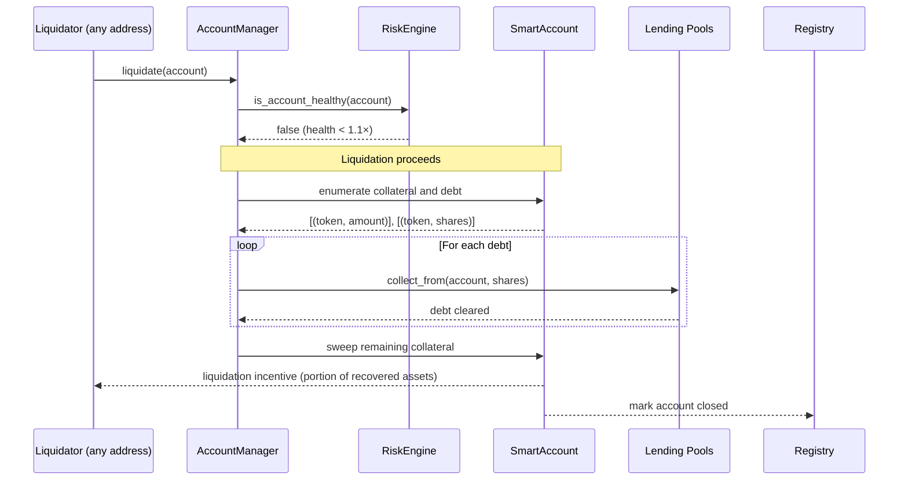

Liquidation is what keeps Vanna solvent. The protocol does not run a trusted keeper to watch positions; it relies on **economic incentives** — any address that detects an unhealthy account and submits a liquidation transaction earns a reward. As long as it's profitable, liquidations will happen. As long as liquidations happen, the protocol's LPs are protected.

## When Liquidation Becomes Possible

The moment an account's [health factor](/learn/health-factor) drops below **1.1×**, the account becomes liquidation-eligible. This can happen via several routes:

1. **Collateral price decline.** A user's WETH collateral drops 30%; the position is now under-collateralized relative to debt.
2. **Debt price increase.** A user's USDC borrow becomes more valuable in collateral terms — less common but possible during stablecoin volatility.
3. **Interest accrual.** A long-dormant borrow accumulates enough interest that the debt grows past the collateral buffer.
4. **External position loss.** A Blend or Aquarius position the account holds as collateral loses value due to underlying protocol changes.

All four collapse into the same on-chain check: `is_account_healthy(account)` returns false.

## The Liquidation Flow

*Figure: Liquidation flow. The liquidator initiates; the protocol enumerates positions, clears debt, sweeps collateral, and pays the incentive.*

<Steps>
  <Step title="Detection">
    A liquidator monitors accounts off-chain (via Mercury on Stellar, via The Graph or direct RPC on EVM) and identifies one whose health factor is below 1.1×.
  </Step>
  <Step title="Initiation">
    The liquidator calls `AccountManager.liquidate(account_address)`. There is no permission check — anyone can call this. The Account Manager re-verifies the account is unhealthy via the Risk Engine before proceeding.
  </Step>
  <Step title="Debt repayment">
    For every token the account has borrowed, the Account Manager calls `LendingPool.collect_from(account, shares)` to clear the debt. The borrowed asset is transferred from the Smart Account back to the pool.
  </Step>
  <Step title="Collateral sweep and incentive">
    Any remaining collateral in the Smart Account is swept. A portion is paid to the liquidator as their incentive; the remainder, if any, returns to the original owner.
  </Step>
  <Step title="Account closure">
    The Smart Account is marked closed in the Registry. The position is fully unwound.
  </Step>
</Steps>

## What Happens to the Original Owner

Liquidation does not destroy all of the owner's value. The order of operations is:

1. **Debt is cleared first** using the account's collateral. The Lending Pools are made whole (the LP side of the market is protected).
2. **The liquidator is paid** their incentive, typically a fixed percentage of the recovered value.
3. **The remainder, if positive, returns to the owner.**

In the typical case (price moved against the trader but not catastrophically), the owner recovers some value. In the extreme case (collateral is worth less than debt + incentive — "bad debt"), the LPs of the affected pool absorb the shortfall by way of a reduced [vToken](/learn/vtokens) exchange rate.

## Why Permissionless

Vanna does not run a "liquidation bot" as a privileged actor for two reasons:

- **Trust minimization.** A privileged liquidator is a single point of failure. If it goes offline, accounts go unliquidated, bad debt accumulates, LPs lose. Permissionless liquidation means the protocol functions as long as *anyone* is watching — and many parties watch in their own self-interest.
- **Economic correctness.** A liquidator's incentive is calibrated so that competition keeps prices honest. If the incentive is too high, multiple liquidators race and the protocol overpays. If too low, liquidations are skipped and bad debt accrues. Permissionless liquidation lets the market discover the right level.

## Settlement: The Voluntary Alternative

A trader who realizes their position is in trouble has a softer option than waiting for liquidation: **settlement**.

Settlement is a controlled close where the owner:

1. Repays as much debt as their wallet can cover.
2. Sells remaining collateral on-chain (via `execute()` to an AMM) to repay the rest.
3. Closes the account voluntarily.

The advantage is that the owner controls the swap rate, avoids the liquidator's incentive, and keeps any leftover collateral. The disadvantage is that settlement requires the account to actually be healthy at the moment of close — which means the trader must act *before* the ratio breaches 1.1×.

Settlement is just the normal repay + close flow, executed quickly. There is no special on-chain "settle" function — only the discipline to act ahead of a forced close.

## Liquidator Economics

A would-be liquidator weighs:

| Income | Cost |
|---|---|
| Liquidation incentive (% of recovered collateral) | Gas / transaction fee on the chain |
| Any positive remainder of swap slippage | Slippage from selling collateral on the open market |
| | Capital required to front-run other liquidators |

Profitable liquidations happen when the incentive exceeds gas + slippage. Vanna's incentive parameter is set so that ordinary liquidations are profitable to single-transaction bots while not over-rewarding extreme cases.

## What Liquidation Doesn't Do

- **It does not free other accounts.** Each Smart Account is isolated. Liquidating one has no effect on any other.
- **It does not change pool rates.** The pool's `total_assets` and `total_borrows` both decrease in the typical case, leaving utilization roughly unchanged.
- **It does not punish the owner beyond the incentive paid.** There is no penalty fee, no protocol fine, no slashing. The owner pays the liquidator's incentive and any residual value returns to them.

## Chain Support

<Snippet file="chain-support-table.mdx" />

## Related

- [Health Factor](/learn/health-factor) — what triggers liquidation
- [Smart Accounts](/learn/smart-accounts) — the unit being liquidated
- [Risk Model](/security/risk-model) — full risk treatment, including bad-debt scenarios
- [Liquidation Flow](/developers/flows/liquidation) — the developer-side step-by-step
